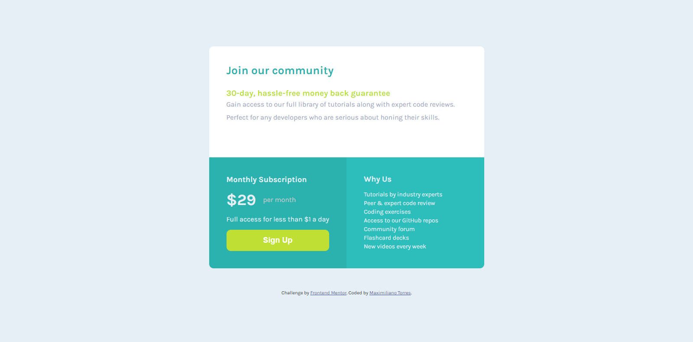

# Frontend Mentor - Single price grid component solution

This is a solution to the [Single price grid component challenge on Frontend Mentor](https://www.frontendmentor.io/challenges/single-price-grid-component-5ce41129d0ff452fec5abbbc). Frontend Mentor challenges help you improve your coding skills by building realistic projects. 

## Table of contents

- [Overview](#overview)
  - [The challenge](#the-challenge)
  - [Screenshot](#screenshot)
  - [Links](#links)
- [My process](#my-process)
  - [Built with](#built-with)
  - [What I learned](#what-i-learned)
  - [Continued development](#continued-development)
- [Author](#author)

**Note: Delete this note and update the table of contents based on what sections you keep.**

## Overview

### The challenge

Users should be able to:

- View the optimal layout for the component depending on their device's screen size
- See a hover state on desktop for the Sign Up call-to-action

### Screenshot

### Links

- Solution URL: (https://startling-d2696e.netlify.app/)

## My process

### Built with

- Semantic HTML5 markup
- CSS custom properties
- Flexbox
- CSS Grid

### What I learned

My second FrontEnd challenge, I learned a bit more about the Grid Layout in CSS, as well as a better understanding of how to structure HTML.

### Continued development

I would like to continue practicing with CSS Grid to better structure the pages, and try to better understand when it would be more convenient to use the Grid Areas system and when to structure based on Row-Template and Column-Template. I would also like to continue researching and practicing relative measurements like "em", which still present me with some problems when I want to translate my px measurements to this unit.

## Author

- Frontend Mentor - (https://www.frontendmentor.io/profile/MaxiTRR)

